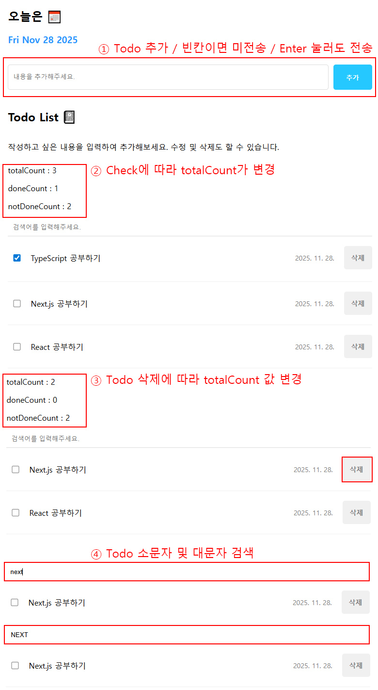
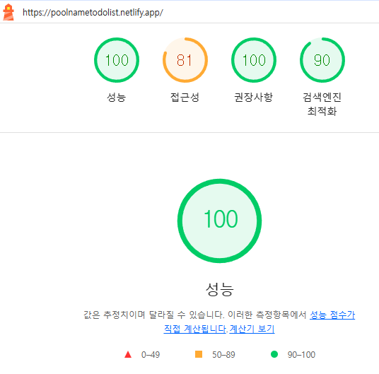

링크 주소 : https://poolnametodolist.netlify.app/

1. 투두 관리 기능 (CRUD Operations)
- 추가 (Create): 사용자가 내용을 입력하고 '추가' 버튼을 누르거나 Enter 키를 입력하여 새로운 할 일을 목록에 추가할 수 있습니다.
빈 내용 입력 시 추가되지 않고 입력창에 포커싱됩니다.
- 조회 (Read): 현재 상태에 따라 전체 할 일 목록을 표시합니다.
- 수정/토글 (Update - Check): 각 항목의 체크박스를 클릭하여 할 일의 완료 상태를 토글할 수 있습니다.
- 삭제 (Delete): 각 항목의 '삭제' 버튼을 클릭하여 해당 할 일을 목록에서 완전히 제거할 수 있습니다.

2. 효율적인 상태 관리
- useReducer를 통한 상태 관리: Todo 데이터의 생성, 수정, 삭제 로직을 reducer 함수로 완전히 분리하여,
복잡한 상태 변경 로직을 체계적이고 예측 가능하게 관리합니다. (App.js 외부의 reducer 함수)
- useCallback으로 이벤트 핸들러 최적화: onCreate, onCheckUpdate, onDelete와 같은 이벤트 핸들러 함수들을
useCallback으로 메모이제이션하여, 컴포넌트 리렌더링 시 불필요하게 함수가 재생성되는 것을 방지합니다.

3. 목록 필터링 및 검색
- 실시간 검색 기능: 상단의 검색 입력란에 키워드를 입력하면 할 일 내용(content)을
기준으로 실시간으로 필터링하여 보여줍니다. (대소문자 구분 없음)

4. 성능 최적화 (Memoization)
- memo를 사용한 컴포넌트 최적화: Header, Editor, List, TodoItem 등 대부분의 하위 컴포넌트를
React.memo로 감싸 Props가 변경되지 않으면 리렌더링을 건너뛰도록 성능을 최적화했습니다.
- useMemo를 사용한 무거운 계산 최적화: 할 일의 총 개수, 완료 개수, 미완료 개수를 계산하는 로직을
useMemo로 감싸 todos 상태가 변경될 때만 다시 계산하도록 최적화했습니다.

5. 사용자 경험 개선 (UX)
- 날짜 표시: 각 할 일 항목에 추가된 날짜를 로컬 형식으로 표시합니다.
- 상태 요약 정보: 현재 할 일의 총 개수, 완료된 개수, 미완료된 개수를 상단에 요약하여 보여줍니다.

기술 스택 (Tech Stack)
프론트엔드: React, JavaScript (ES6+)
상태 관리: useState, useReducer, useRef
성능 최적화: useCallback, useMemo
